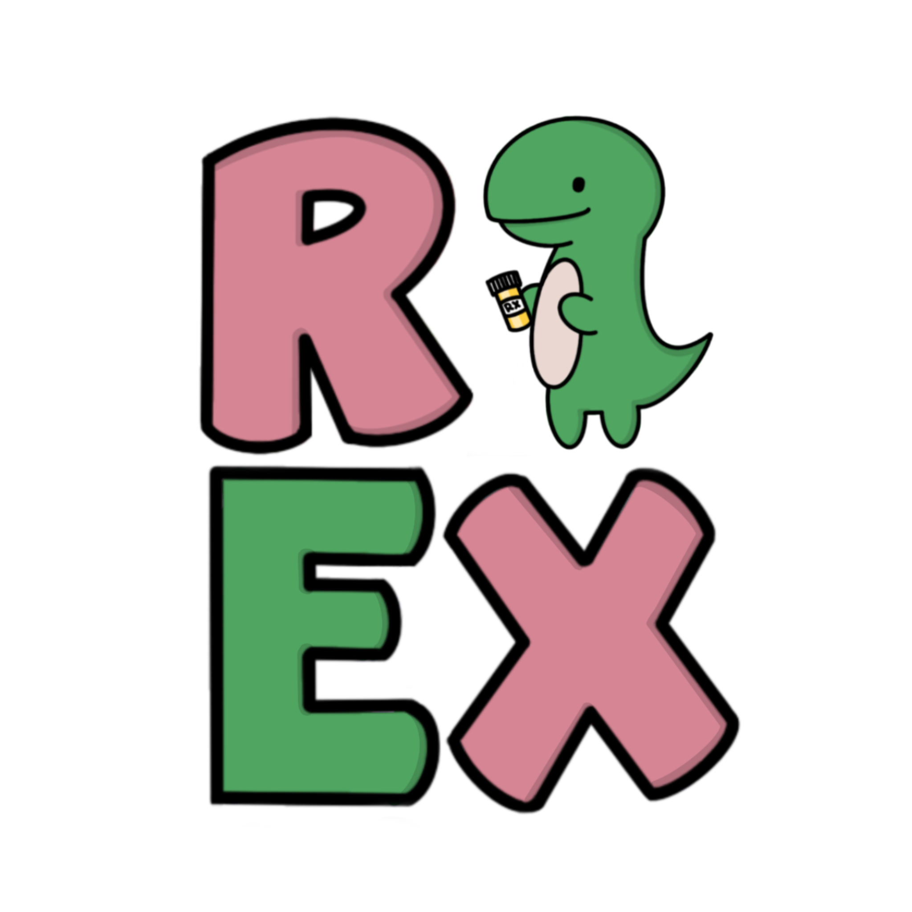

# Rex App

An iOS mobile app designed to aide those who are visually impaired read their prescription bottles. Sign up or log in and then simply scan a photo of said prescription bottle to have your prescription read out loud.

## Tech Stack
- JavaScript
- React Native
- Node JS
- Google Cloud Vision API
- Firebase
- Expo Voice

## Setup

Download on Expo Go using our QR code.

## Authors

[Emily Higgins](https://www.linkedin.com/in/-emily-higgins/) |
[Cristina Satterfield](https://www.linkedin.com/in/cristina-satterfield/) |
[Jessica Lennick](https://www.linkedin.com/in/jessicalennick/) |
[Shristi Gaujurel](https://www.linkedin.com/in/shristigajurel/)

Special thanks to Dennese Sanay and Orlando Caraballo for their guidance.

## The App
Check out a demo of the app here: https://youtu.be/8-wOLyMvtgo.

